# Chap

**Chap** is a self-hosted deployment platform inspired by [Coolify](https://coolify.io/) and [Pterodactyl / Pelican](https://pterodactyl.io/), designed to give you full control over your applications, databases, and services on your own infrastructure. Althought not designed with the intention to be, it could be used as a service to sell hosting services such as what [Pterodactyl / Pelican](https://pterodactyl.io/) does.

<p align="center">
  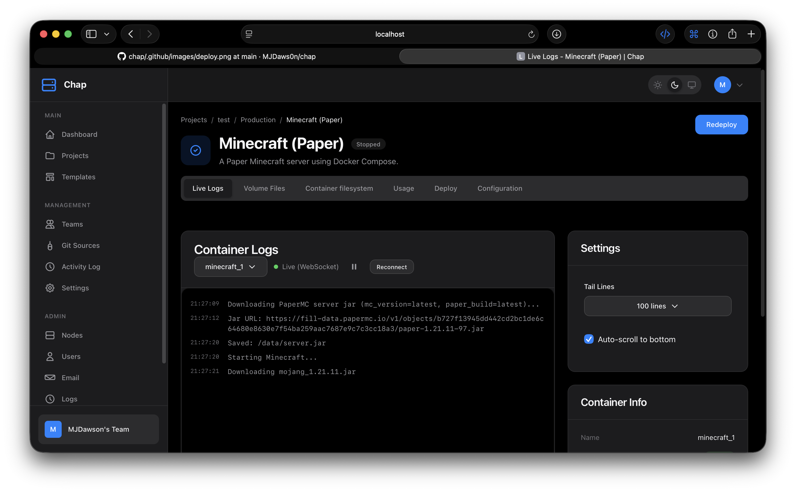
  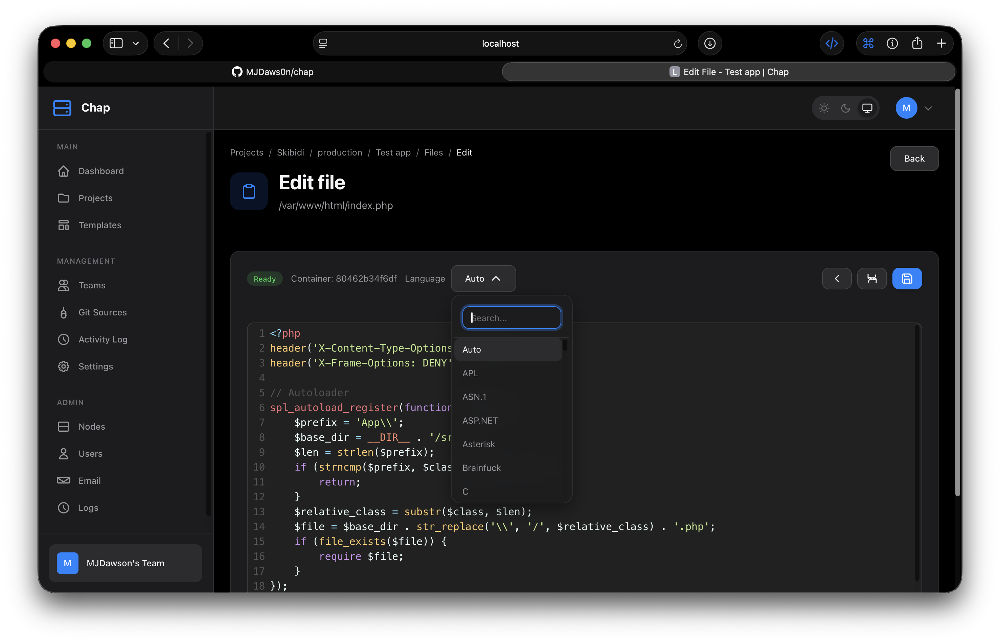
  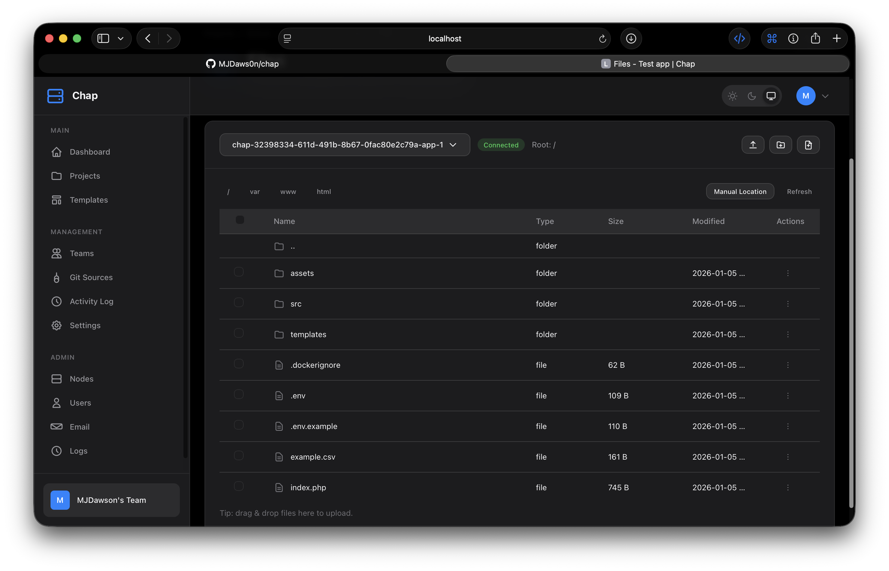
</p>

<p align="center">
  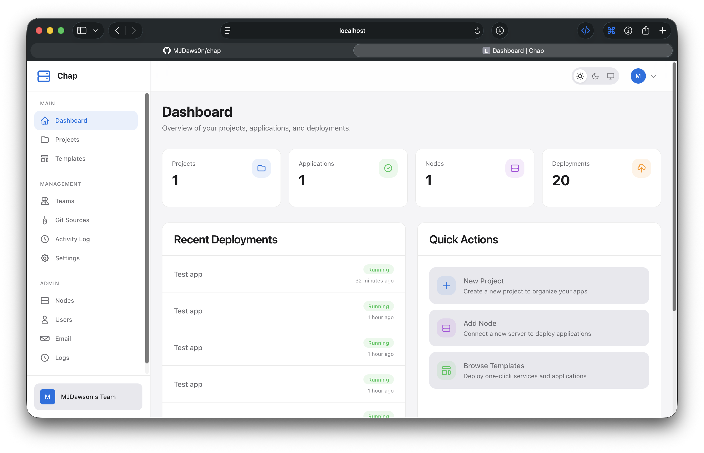
  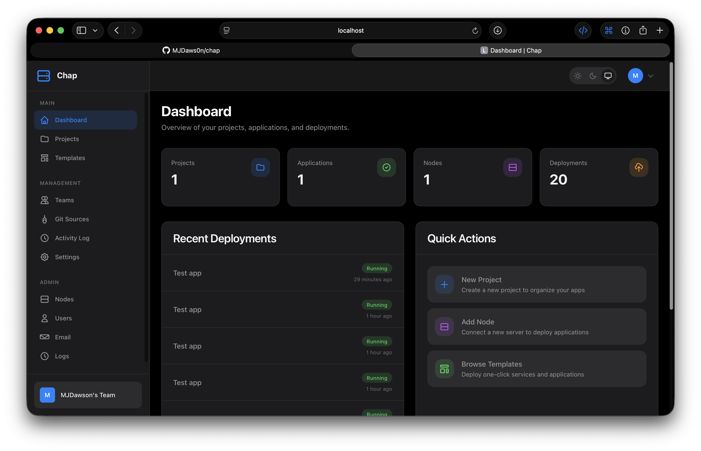
  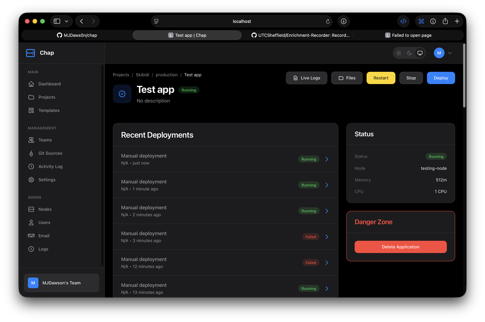
  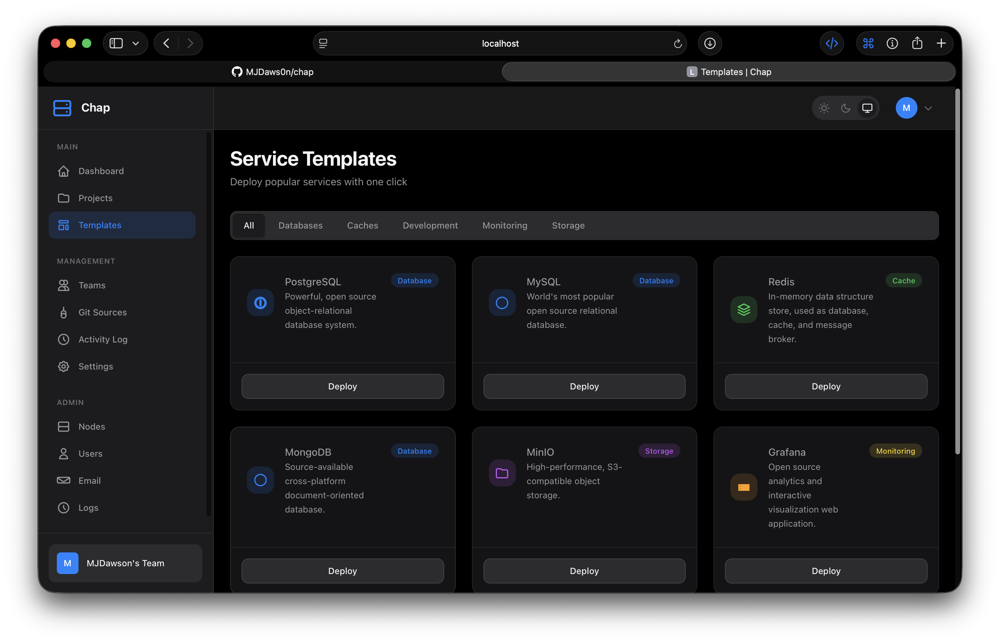
  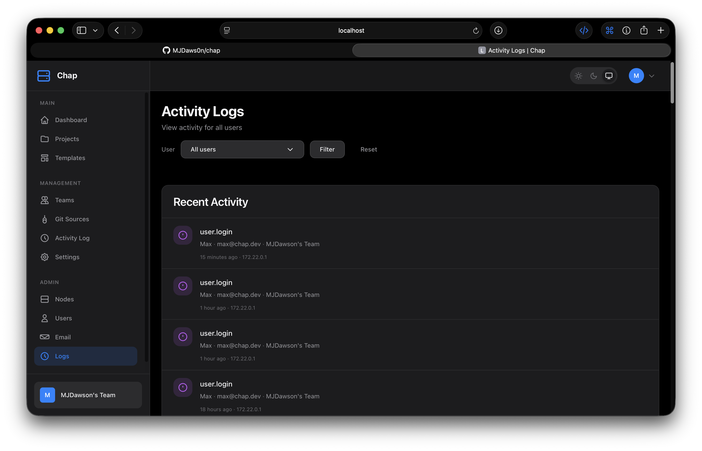
  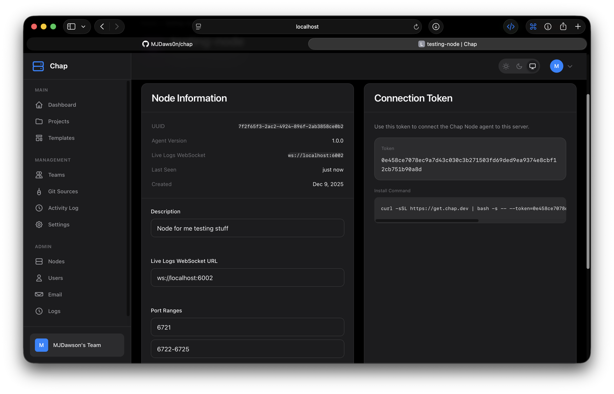
  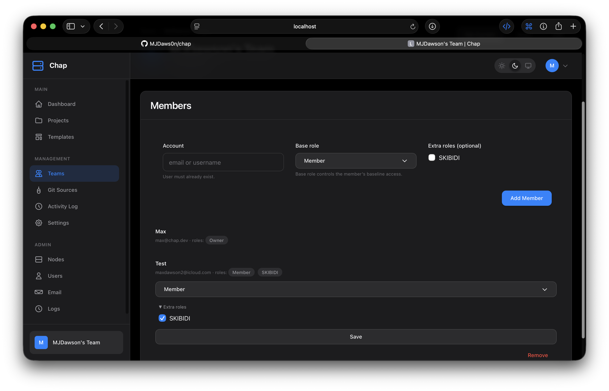
  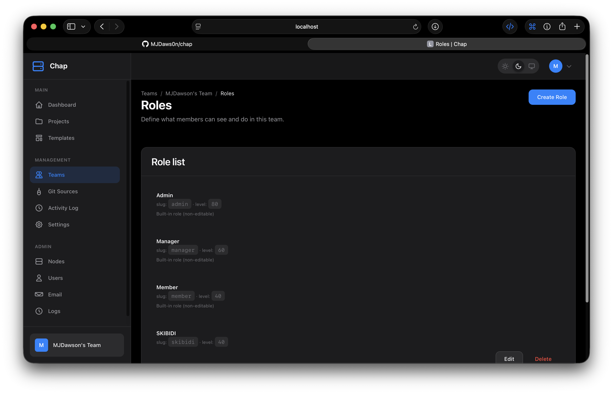
  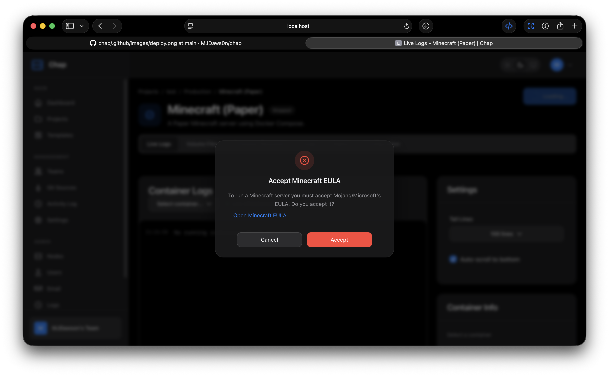
</p>

## Features

- 🚀 **Git-based Deployments** - Connect GitHub repositories and deploy on every push
- 📦 **Docker Native** - All applications run in secure\* containers for consistency and isolation
- 🖥️ **Multi-Server Support** - Connect and manage multiple servers (nodes) from a single dashboard
- 👥 **Team Collaboration** - Role-based access control with team workspaces
- 📊 **Real-time Monitoring** - Live logs and container metrics
- 🎯 **One-Click Services** - Deploy databases and popular services instantly
- 🔒 **Secure by Design** - Environment variables, secrets management, MFA, human verifcation all built into the software.

\* Software has been tested, however no warranty is included when running software and I am not responsible for any related incidents to this software..

## Architecture

Chap consists of two components that run on **separate (or same) servers**:

| Component | Where it runs | What it does |
|-----------|--------------|--------------|
| **chap-server** | One central server | Web UI, API, database, WebSocket hub |
| **chap-node** | Each deployment server | Docker management, builds, deployments, live logging WebSocket |

```
┌─────────────────────────────────────────────────────────────────┐
│                        BROWSER CLIENT                           │
│                  (Dashboard / Live Logs UI)                     │ ───┐
└───────────────────────────────┬─────────────────────────────────┘    │
                                │ HTTP / HTTPS                         │
                                ▼                                      │
┌─────────────────────────────────────────────────────────────────┐    │
│                        CENTRAL SERVER                           │    │
│  ┌───────────────────────────────────────────────────────────┐  │    │
│  │                        Chap Server                        │  │    │
│  │     Apache / PHP  ◄──►  MySQL                             │  │    │
│  │     (auth, state, UI API, metadata)                       │  │    │
│  └───────────────────────────────────────────────────────────┘  │    │
└───────────────────────────────┬─────────────────────────────────┘    │
                                │ WebSocket (port 8081)                │
           ┌────────────────────┼────────────────────────┐             │
           │                    │                        │             │
           ▼                    ▼                        ▼             │
┌──────────────────┐ ┌──────────────────┐ ┌──────────────────┐         │
│  SERVER A        │ │  SERVER B        │ │  SERVER C        │         │
│  ┌────────────┐  │ │  ┌────────────┐  │ │  ┌────────────┐  │         │
│  │ Chap Node  │  │ │  │ Chap Node  │  │ │  │ Chap Node  │  │         │
│  │  + Docker  │  │ │  │  + Docker  │  │ │  │  + Docker  │  │         │
│  └────────────┘  │ │  └────────────┘  │ │  └────────────┘  │         │
│  Your apps here  │ │  Your apps here  │ │  Your apps here  │         │
└──────────────────┘ └──────────────────┘ └──────────────────┘         │
         ▲                    ▲                     ▲                  │
         └────────────  Direct WebSocket (logs) ────┴──────────────────┘
```
---

## Installation
[Github is a bit easier to read](https://github.com/MJDaws0n/chap/blob/main/install.md)

[Docs has the same information but is harder to read](https://mjdaws0n.github.io/chap/install/)

## Development Setup

For local development (runs server + node on same machine). You may need to use slighlty modified docker files as issues have occured.

```bash
git clone https://github.com/MJDaws0n/chap.git
cd chap
cp .env.example .env
docker compose up -d
```

This starts everything locally at `http://localhost:8080`

---

## Docker Compose Files

| File | Purpose | When to use |
|------|---------|-------------|
| `docker-compose.yml` | Development | Local testing (server + node together) |
| `docker-compose.server.yml` | Production server | Your central/main server |
| `docker-compose.node.yml` | Production node | Each deployment server |

---

## Deploying Applications

### From Git Repository

1. Create a **Project** to organize your applications
2. Create an **Environment** (e.g., production, staging)
3. Add a new **Application**
4. Connect your Git repository
5. Configure build settings (Dockerfile, build commands)
6. Select which **Node** to deploy to
7. Click **Deploy**

### One-Click Services

1. Go to **Templates**
2. Browse available services (PostgreSQL, MySQL, Redis, etc.)
3. Click **Deploy** and select a Node
4. Configure and launch

---

## API
API docs are avaible [here](https://mjdaws0n.github.io/chap/client-api.html)

---

## Configuration

### Server Environment Variables

| Variable | Description | Default |
|----------|-------------|---------|
| `APP_URL` | Public URL of your Chap server | `http://localhost:8080` |
| `APP_SECRET` | Encryption key (min 32 chars) | (required) |
| `DB_PASSWORD` | MySQL password | (required) |
| `GITHUB_CLIENT_ID` | For GitHub OAuth | (optional) |
| `GITHUB_CLIENT_SECRET` | For GitHub OAuth | (optional) |
| `CAPTCHA_PROVIDER` | Human check provider: `none`, `recaptcha`, `autogate` | `none` |
| `CAPTCHA_THEME` | Widget theme hint (e.g. `dark`) | `dark` |
| `RECAPTCHA_SITE_KEY` | Google reCAPTCHA site key (required if using `recaptcha`) | (optional) |
| `RECAPTCHA_SECRET_KEY` | Google reCAPTCHA secret key (required if using `recaptcha`) | (optional) |
| `AUTOGATE_PUBLIC_KEY` | AutoGate\* public key (required if using `autogate`) | (optional) |
| `AUTOGATE_PRIVATE_KEY` | AutoGate\* private key (required if using `autogate`) | (optional) |

\*Autogate is a SAAS softare developed by me and as of 28-01-2026 is not avaiable to the public. If you are interested in using/testing it in your application for free contact me via [my website](https://mjdawson.net/#contact).

### MFA (TOTP)

Chap supports TOTP-based MFA (Authenticator apps) for the dashboard.

- Users can enable/disable MFA at `/profile/mfa` (QR code, clickable `otpauth://` link, and manual secret are shown).
- Admins can reset any user's MFA from the Admin → Users → Edit page (this disables MFA and clears the stored secret).

### Node Environment Variables

| Variable | Description | Default |
|----------|-------------|---------|
| `NODE_ID` | Unique name for this node | (required) |
| `NODE_TOKEN` | Auth token from dashboard | (required) |
| `CHAP_SERVER_URL` | WebSocket URL to server | (required) |
| `BROWSER_WS_HOST` | Bind address for the browser → node logs WebSocket | `0.0.0.0` |
| `BROWSER_WS_PORT` | Port for the browser → node logs WebSocket | `6002` |
| `CHAP_MAX_CPUS` | Max CPU limit per application | `20` |
| `CHAP_MAX_MEMORY` | Max memory limit per application | `20g` |
| `CHAP_MAX_PIDS` | Max PIDs limit per application | `10000` |
| `CHAP_DATA_DIR` | Data directory for Chap to store application data | `/data` |


### Live Logging (WebSocket)

Chap supports live logging using a direct WebSocket connection from the browser to the node agent (WS/WSS). If you want the **Live Logs** page to work, this WebSocket must be configured.

> **NOTICE** The application was originally written with the intention of this being optional, however since that, I gave up writting the code twice, so most things (such as API, files, even deployments) may not work unless you setup this Live Logging WebSocket. Feel free to try without though.

- **Node URL scheme:** When creating a node, set `CHAP_SERVER_URL` to include the scheme: use `wss://your-chap-server:8081` for HTTPS servers, or `ws://your-chap-server:8081` for non-HTTPS servers.
- **Browser → node logs socket:** Configure the node agent's browser WebSocket (WS/WSS) and set each node's `logs_websocket_url` to point at it (e.g. `wss://your-node-host:6002`).
- **Certificates & TLS:** If your dashboard is served over HTTPS, browsers require a secure WebSocket (`wss://`) with a valid certificate for the logs socket. Terminate TLS at a reverse proxy (recommended) or configure the node agent to serve WSS directly.
- **Mixed-content warning:** If the dashboard uses HTTPS but the logs socket uses `ws://`, modern browsers will block it as mixed content.
---

## License
MIT License - see [LICENSE](LICENSE)

## Credits
Created by Max and Copilot.

Inspired by [Coolify](https://coolify.io/) and [Pterodactyl / Pelican](https://pterodactyl.io)